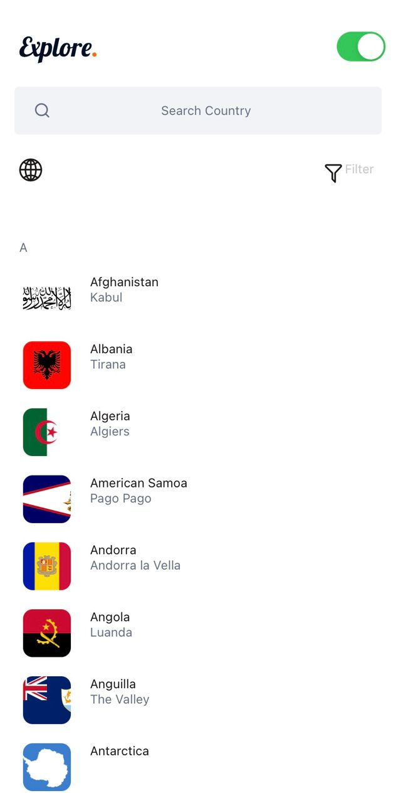
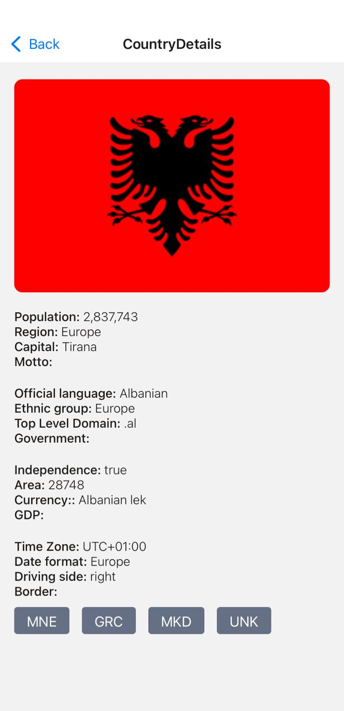
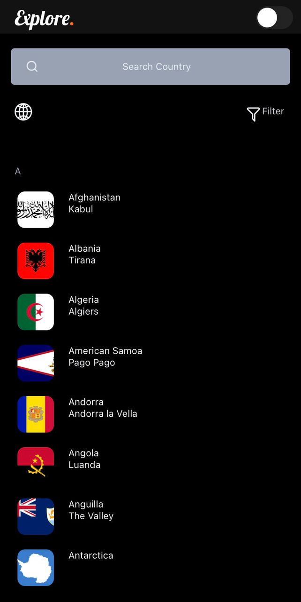
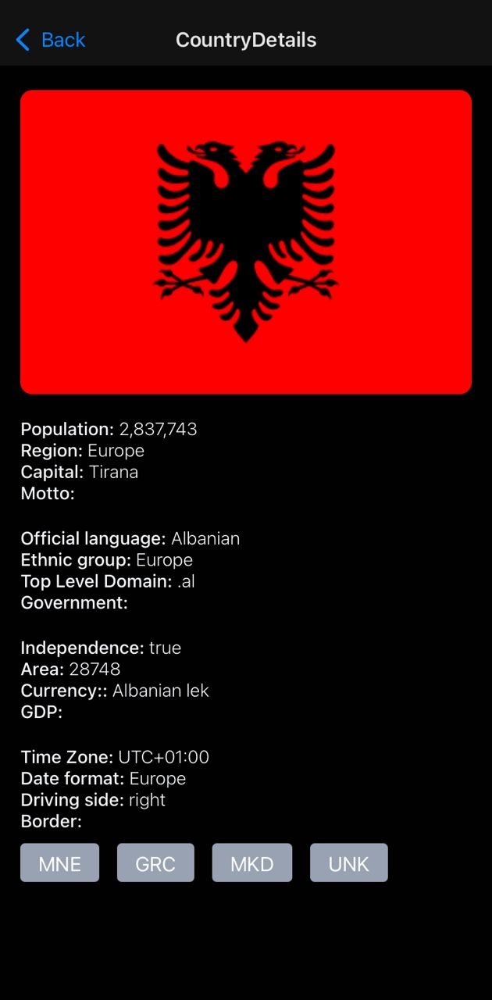

## CONFIND

The main goal of this application is to create a React Application to show a list of countries, and then showing for each country the data associated to it.

---

## Table of Contents

- [The app and its features](#the-app-and-its-features)
- [The codebase and how it works](#the-codebase-and-how-it-works)
- [Libraries used and Why](#libraries-used-and-why)
- [Features I would like to add if there is more time](#features-i-would-like-to-add-if-there-is-more-time)
- [Link to the Apk file](#link-to-the-apk-file)
- [Link to the Appetize.io and usage](#link-to-the-appetize.io)
- [Images of the app](#images-of-the-app)
- [Usage](#usage)
- [License](#license)
- [Author](#author)

---

## The app and its features

The name CONFIND is coined from the word COUNTRYFINDER. The idea behind this application is to create an easy to use application that shows list of countries where the user can search, filter the countries by its region and time zones.
The app allows both the landscape and portrait orientation. The homescreen has a search button at the top which is used to search for countries and under it is the language and filter button. With the language button the user can change to any specific language he or she wants while with the filter button the user can edit search he/she wants, The filter button is implemented with the continent and time zones.
The next section is a list of the countries generated by the api from a-z, With a pressable that can navigate to the details of the pressed country.

---

## The codebase and how it works

All folders are placed under the confind app folder which is the parent folder. This parent folder houses all the folders in the app. The key reason is for anybody to easily navigate to a particular file without being easily confused. Function component with the use of hooks is what is being used and the use of context api to pass the theme children across all other screens. Expo-fonts is used to create the header title in the home screen.
The following are the folder used and what they mean:

- The components folder is used to store components used of the app
- The screen component stores all the screens used of the app
- The navigation component stores the navigator stacks of the app
- The data component stores the array of the filtered object
- The config component which has the context and the theme file stores the theme of the app
- The app.js file is the parent file that runs in the app

---

## Libraries used and Why

- @expo-vector-icons: I was able add icons to the app
- react-native-event-listeners: I was able to bypass using redux and with react native event listener i passed a touch event on the which controls the theme of the app
- @react-navigation/native and @react-navigation/native-stack: With react native navigation, it was easy to navigate across the app
- expo-font: I was able to create a design from the figma design using google font in which expo supports
- react-native-picker-select: I was able to use this on the filter button
- axios: With axios, I was able to call the api, instead of using a fetch method with can't handle large data efficiently

---

## Features I would like to add if there is more time

I am currently on the stage of applying the filter, Another issue I am facing is I am trying as much as possible not to use third-party libraries, because some third party libraries I implemented on some features crashes the app and makes it lag. The originality of the code is the less use of third party library, The downside is I am not able to finish some features on the app hardcoding them.

---

## Link to the Apk file

---

## Link to the Appetize.io and usage

---

## Images of the app

<div align="center">
  
  
  
  
</div>
<br>
<div align="center">
  <h3>React Native Countries App</h3>
  
  
</div>

## Usage

Clone the app and in your terminal input git clone with github url, when it is done. Do the following

```
$ yarn install
$ yarn start
```

---

## License:

Licensed under the [MIT](https://github.com/Davidon4/Confind/blob/main/LICENSE).

---

## Author:

[Juggernaut.dev](https://github.com/Davidon4)
